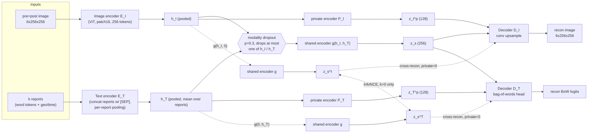
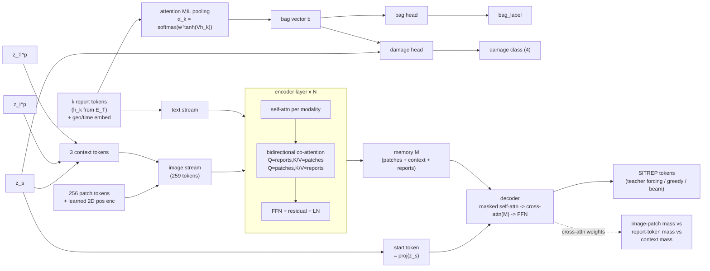

# disaster-mm-sitrep

A multimodal (satellite imagery + geotagged text reports) disaster-response
model in PyTorch. Given a pre/post-disaster satellite chip and the geotagged
text reports near it, the model produces:

- a **SITREP** (situation report) as generated text,
- a **tile damage class** (none / minor / major / destroyed),
- **attention-based evidence maps** showing which image patches and which
  reports the model used, and
- **"unverified" flags** on generated sentences that neither the image nor
  any single report actually supports.

Authors: **Sidhant Nair**, **Sahishnu Raut**. MIT license. Python 3.10+.

All results in this README are training runs on **procedurally generated
synthetic data** (see [Synthetic data results](#synthetic-data-results)) —
no real satellite or crisis-response dataset is downloaded or trained on in
this repo or in CI.

## Contents

- [Overview](#overview)
- [Architecture](#architecture)
- [Data contract](#data-contract)
- [How to run](#how-to-run)
- [Plugging in real datasets](#plugging-in-real-datasets)
- [Design choices](#design-choices)
- [Synthetic data results](#synthetic-data-results)
- [Limitations](#limitations)
- [References](#references)

## Overview

The system is trained in two parts and three stages:

1. **Part 1 — multimodal autoencoder** (`part1_mmae.py`): learns a shared
   image/text latent space plus per-modality private latents, via
   reconstruction, cross-modal reconstruction, a soft orthogonality penalty
   between shared and private codes, and an InfoNCE contrastive term that
   pulls the image-only and text-only shared codes of the same tile
   together.
2. **Part 2 — cross-attention encoder-decoder** (`part2_seq2seq.py`): takes
   the image patch tokens and per-report embeddings from Part 1, runs them
   through bidirectional co-attention, pools reports via attention-based
   multiple-instance learning (MIL), and decodes a SITREP while also
   predicting the tile damage class and report-relevance ("bag") label.

Training stages (`disaster_mm.train --stage {1,2,3}`):

1. Train Part 1 alone with the reconstruction/alignment loss `L1`.
2. Freeze Part 1's encoders, train Part 2 alone with `L2`.
3. Unfreeze everything and jointly fine-tune both at a low learning rate.

## Architecture

### Part 1: multimodal autoencoder



`L1 = λ_r(MSE + BCE) + λ_c·cross-reconstruction + λ_⊥(‖S_Iᵀ P_I‖²_F +
‖S_Tᵀ P_T‖²_F) + λ_n·InfoNCE(z_s^I, z_s^T)`.

### Part 2: cross-attention encoder-decoder



`L2 = CE(sitrep) + λ_d·CE(damage) + λ_b·BCE(bag) + λ_g·grounding loss`
(grounding loss pushes decoder attention on damage words toward patches
inside a building with matching ground-truth damage).

## Data contract

One sample = one tile:

**Input**
- `image`: float tensor `6x256x256` (pre RGB + post RGB stacked)
- `reports`: list of `k` reports (`0 <= k <= 32`), each `<=64` tokens, each
  with a geo offset `(dx, dy)` in km and a time offset in hours

**Targets**
- `sitrep`: token sequence (templated text)
- `damage`: int in `{0 none, 1 minor, 2 major, 3 destroyed}`
- `bag_label`: 1 if any report is relevant to the tile, else 0
- `building_masks` / `building_damage`: optional per-building masks with
  per-building damage, for grounding / pointing-accuracy evaluation

`k=0` is handled everywhere: padding, masks, and every attention/pooling op
that could see an all-padded row is routed through explicit no-NaN
fallbacks (learned null embeddings, or a zeroed contribution) — see
`models/text_encoder.py` and `models/part2_seq2seq.py` for exactly where.

## How to run

```bash
pip install -e ".[dev]"
python -m disaster_mm.train --config configs/tiny.yaml --stage 1   # Part 1 (L1)
python -m disaster_mm.train --config configs/tiny.yaml --stage 2   # Part 2, Part 1 frozen (L2)
```

Then, optionally, stage 3 (joint fine-tune), evaluation, and single-tile inference:

```bash
python -m disaster_mm.train --config configs/tiny.yaml --stage 3
python -m disaster_mm.evaluate --config configs/tiny.yaml --stage 3
python -m disaster_mm.infer --config configs/tiny.yaml --stage 3 --out_dir out/
```

`configs/tiny.yaml` runs entirely on CPU with synthetic data and finishes
all three stages in a few minutes; `configs/base.yaml` is real-scale
(ViT-B/16 + BERT-base, GPU, downloads pretrained weights on first use — not
run in CI). `scripts/run_tiny_pipeline.sh` runs the whole tiny pipeline plus
evaluation in one go.

Run the tests:

```bash
pytest
ruff check .
```

## Plugging in real datasets

`data/loaders_stub.py` documents (but does not download) three real
datasets and how to convert them to this repo's `TileSample` contract:

- **xBD / xView2** (Gupta et al. 2019): pre/post image pairs + per-building
  damage polygons — the closest match to this repo's image/damage-mask
  contract. No text, so reports must come from elsewhere.
- **CrisisMMD** (Alam et al. 2018): real geotagged tweets with images and
  humanitarian-category labels — a source of realistic report text.
- **FloodNet** (Rahnemoonfar et al. 2021): UAV post-flood imagery with
  segmentation masks — a source of realistic post-disaster masks.

`bag_reports_by_geo_time` in the same module implements the geo/time
bagging utility: given a tile's center and capture time plus a flat list of
geotagged reports, it returns the subset within a radius/time window,
annotated with the `dx`/`dy`/`dt` fields the dataset contract expects — the
same shape of data the synthetic generator produces directly.

Manual download instructions and expected on-disk layout are in each
loader's docstring; none of this is exercised by CI, per the project brief.

## Design choices

- **Autoencoder vs CCA**: Part 1 is a *deep* shared/private autoencoder
  (Ngiam et al. 2011 bimodal autoencoder style, with a Domain-Separation-
  Networks-style orthogonality penalty from Bousmalis et al. 2016) rather
  than linear CCA (Andrew et al. 2013's DCCA is the deep generalization of
  CCA). We keep classical CCA as a baseline/diagnostic
  (`models/cca_baseline.py`) precisely so the learned shared space can be
  compared against a linear reference.
- **D_I reconstructs the full 6-channel input** (pre+post), not just the
  post frame, since the encoder is given both frames — this gives a
  stronger self-supervised signal and implicitly rewards a
  change-sensitive shared code.
- **Modality dropout only touches the shared encoder's inputs.** Private
  encoders always see their real modality, since private detail is by
  definition not recoverable from the other modality.
- **Cross-reconstruction** reconstructs each modality from the *other*
  modality's shared code alone, with the private code zeroed (it can't be
  inferred cross-modally) — this is what makes the shared code carry
  transferable information rather than degenerating to a copy of one
  modality.
- **Attention for latent alignment, DTW for explicit alignment**: the
  learned bidirectional co-attention (Vaswani et al. 2017-style) in Part 2
  is the primary, trainable image<->text alignment mechanism. `dtw.py`
  (cosine-cost dynamic time warping) is a separate, non-learned, exact
  alignment tool for explicitly aligning two embedding sequences (e.g. a
  generated SITREP's sentence embeddings against a tile's report
  embeddings) — useful as a diagnostic independent of what the attention
  heads happened to learn.
- **"Report tokens" in Part 2 are per-report pooled embeddings**, not raw
  word tokens — this bounds the encoder sequence to `256 + 32 + 3 = 291`
  tokens regardless of report length, which is where MIL pooling
  (Ilse et al. 2018) operates.
- **Generative + retrieval check**: the decoder is generative (it can
  produce novel phrasing), but generative text isn't inherently
  trustworthy, so `retrieval_check.py` adds a retrieval-style check —
  embedding each generated sentence and requiring either strong
  image-similarity or strong report support (MIL attention) before
  treating it as verified.

## Synthetic data results

Measured by running `configs/tiny.yaml` end to end (`stage 1` -> `stage 2`
-> `stage 3` -> `evaluate`) exactly as shipped in this repo: 64 synthetic
train tiles, 16 test tiles, 3+3+2 epochs, tiny model sizes, CPU only. These
are the actual numbers from that run (see `runs/tiny/metrics.json`) — not
representative of real-world performance, and not tuned (this is a smoke
scale run, meant to demonstrate the pipeline works end to end and to give a
baseline to compare future changes against).

| Metric (test split, n=16) | Full model | Image dropped | Text dropped |
|---|---|---|---|
| Damage weighted F1 | 0.625 | 0.625 | 0.007 |
| Bag (report-relevance) weighted F1 | 0.875 | 0.875 | 0.405 |
| SITREP BLEU | 7.05 | 7.41 | 7.05 |
| Templated count/bridge/level accuracy | 0.0 / 0.0 / 0.0 | 0.0 / 0.0 / 0.0 | 0.0 / 0.0 / 0.0 |

Takeaways from this smoke run:
- Damage classification degrades sharply when text is dropped (F1
  0.625 -> 0.007) but not when image is dropped, which is the expected
  asymmetry for this synthetic generator's damage signal (damage is driven
  by an image-visible epicenter pattern that the model has partially
  picked up, while distractor/need-only reports add text-only noise the
  damage head has learned to mostly ignore).
  Bag-label F1, by contrast, drops substantially when text is dropped
  (0.875 -> 0.405), as expected since report relevance is a text-only
  signal.
- BLEU and templated-field accuracy are low: with only 8 gradient epochs
  total across 64 training tiles, the decoder has not yet converged to
  reliably reproducing the exact templated phrasing (`count_fact_accuracy`
  requires an exact regex match against the template, so this is a strict
  metric that is near-zero until the decoder has clearly converged; loss
  curves in the three training stages are monotonically decreasing over
  this same run, see the `pytest` overfit tests for confirmation that the
  loss *can* be driven down substantially given more steps on a fixed
  batch).
- These numbers will improve with more epochs / more synthetic data /
  `configs/base.yaml`'s real-scale model; they are recorded here as an
  honest baseline, not a claim of quality.

## Limitations

- The synthetic generator is a simplified procedural scene (grid of
  rectangular buildings, a diagonal river band, cross-shaped roads) — it is
  useful for exercising the full pipeline and shape/NaN correctness, but it
  is not a substitute for training/evaluating on real imagery.
- Beam search in `part2_seq2seq.py` runs one sample at a time (simple,
  correct, but not batched/parallelized) — fine at the tiny scale this repo
  targets, but would need batching for large-scale inference.
- The grounding loss's damage-word list is a small fixed lexicon tied to
  the synthetic SITREP templates; it would need to be extended (or learned)
  for free-form real-world report text.
- `configs/base.yaml` (ViT-B/16 + BERT-base) is provided but not trained or
  evaluated in this repo — it downloads pretrained weights and needs a GPU,
  neither of which is available in CI.
- Real-dataset loaders (`data/loaders_stub.py`) are documented but
  unimplemented stubs; wiring up xBD/CrisisMMD/FloodNet requires the
  datasets to be downloaded manually (links in the docstrings).

## References

- Ngiam, J. et al. (2011). *Multimodal Deep Learning.*
- Andrew, G. et al. (2013). *Deep Canonical Correlation Analysis.*
- Vaswani, A. et al. (2017). *Attention Is All You Need.*
- Ilse, M., Tomczak, J., & Welling, M. (2018). *Attention-based Deep
  Multiple Instance Learning.*
- Gupta, R. et al. (2019). *xBD: A Dataset for Assessing Building Damage
  from Satellite Imagery.*
- Alam, F., Ofli, F., & Imran, M. (2018). *CrisisMMD: Multimodal Twitter
  Datasets from Natural Disasters.*
- Rahnemoonfar, M. et al. (2021). *FloodNet: A High Resolution Aerial
  Imagery Dataset for Post Flood Scene Understanding.*
- Bousmalis, K. et al. (2016). *Domain Separation Networks* (source of the
  soft-orthogonality penalty used between shared and private codes).

## Authors

Sidhant Nair, Sahishnu Raut
